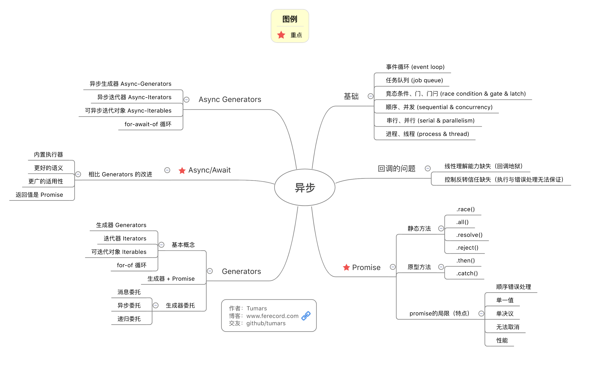

# 1.事件循环（Event Loop）机制

众所周知，JavaScript的一大特点就是是单线程，所有任务都需要在主线程里排队等待执行。

而JavaScript里的任务又分为同步任务和异步任务两种，基于事件循环（Event Loop）机制执行任务。

同步任务作为首要任务会在主线程里执行，异步任务则被“发配”到由另一个线程管理的任务队列中等待处理。异步任务符合条件（比如ajax请求到数据，setTimeout延时到期）后，会在任务队列中添加可执行“事件”，等待主线程中的同步任务执行完毕到任务队列里读取当前可执行的任务，将其加入主线程中执行，以此循环。

根据HTML Standard中的描述，一个事件循环中的执行流程大致如下。

1.选择最早的任务

2.设置事件循环中当前任务为上一步中选择的任务

3.执行该任务

4.将事件循环中的当前任务重新设置为空

5.将主线程中执行的任务移除

6.执行Microtask中的任务

7.执行页面渲染步骤，更新UI

# 2.JavaScript中的异步任务



能在JavaScript中执行异步任务的一般有以下这几种方法。

（1）最常见的有定时器函数 setTimeout、setInterval 和 setImmediate

setTimeout 和 setInterval 都是指定在 time 后在任务队列里添加相关“事件”，通知主线程把相应任务放到主线程中去执行。

setImmediate 作为一个新的 API，可以马上将相关“事件”添加到任务队列里，通知主线程把相应任务放到主线程中去执行。

（2）Promise

Promise.then 中传入了一个回调函数，将在 Promise 对象进行决议(resolve/reject)后进行异步回调。

（3）MutationObserver

MutationObserver 提供了监听在特定范围内 DOM 树发生变化事件的能力，并提供回调函数可以作出适当反应的能力。

（4）process.nextTick

```javascript
// 观察一下一段代码
console.log('Start');

setTimeout(() => {
    console.log('setTimeout');
}, 0);

Promise.resolve().then(() => {
    console.log('Promise ');
});

let observer = new MutationObserver(()=>{
    console.log('MutationObserver ');
});
let target = document.querySelector('#id');
observer.observe(target, config);
/* target进行某些变化*/

console.log('End');

// 输出
// Start
// End
// Promise
// MutationObserver
// setTimeout
```

不是说异步任务完成后会依次通知主线程到任务队列里获取可执行回调到主线程中执行吗？按照逻辑应该是 setTimeout是任务队列中最早的任务，主线程应该首先执行setTimeout的回调。

如果在Node中加代码后加上process.nextTick，process.nextTick的回调仍然在setTimeout回调之前执行，这个顺序是怎么确定的呢？

# 3.JavaScript中的任务队列

通过阅读Promise/A+规范，可以得知异步的实现可分为两个机制，分别是macro-task和micro-task。

Macrotasks包括: script（整体代码）、setTimeout, setInterval, setImmediate, I/O, UI Rendering；

Microtasks包括: process.nextTick, Promise, Object.observe, MutationObserver。

Macrotasks、Microtasks执行机制：

1.主线程执行完后会先到micro-task队列中读取可执行任务

2.主线程执行micro-task任务

3.主线程到macro-task任务队列中读取可执行任务

4.主线程执行macro-task任务

5....转到Step 1

这里注意的是，UI Rendering是在micro-task之后执行，需要在UI渲染之前执行的逻辑，一般采用micro-task异步回调方式进行调用。

同样，micro-task队列不宜过长，给micro-task队列添加过多回调阻塞macro-task队列的任务执行是小事，重点是这有可能会阻塞UI Render，导致页面不能更新。浏览器也会基于性能方面的考虑，对micro-task中的任务个数进行限制。

## 参考文献

任务队列：https://imweb.io/topic/5a27610da192c3b460fce29f
promise：https://www.miaoroom.com/code/ued/javascript/promise-guide.html
async/await：
- http://www.ruanyifeng.com/blog/2015/05/async.html
- https://www.miaoroom.com/code/ued/javascript/async-await-guide.html